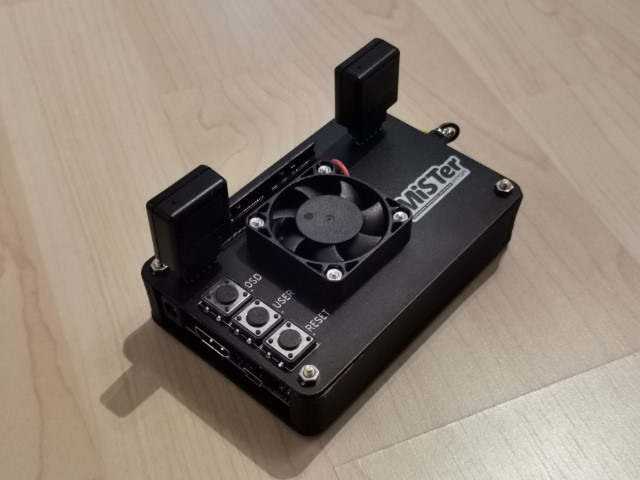

# MiSTer-PCB

# A DIY low-profile case for the MiSTer Project!

Build a nice, minimal case that works very well with 8bitdo sega controllers.  When it's finished, you'll have a case with just a single power cables, and a custom short OTG USB cable fo a very tidy setup.

## Parts List
For this project you will need:
- 1x DE10 Nano
- 1x Arduino Pro Micro
- 2 PCB's, the designs and schematics are in this repo
- 4x M3 16mm bolts
- 4x M3 nuts
- 2x 3D printed side panels or 8x M3 nuts
- 3x 12mm buttons
- single-row pin header, male and female
- 2x 8BitDo M30 2.4G wireless controllers
- 40mm 5V fan (optional)
- heatsink (optional)
- SDRAM (optional)

# Flashing the Arduino
Grabe the code from this Repo:
https://github.com/MickGyver/DaemonBite-Retro-Controllers-USB

**NOTE! Make sure you use the code from the SegaTwoControllersUSB Folder**

Use the latest Arduino GUI to flash the Arduino Pro Micro via USB. This can also be done after the board is assembled.

# Building the Case

You need to get some PCB's made. In this repo are the Eagle board files. I had black PCB's with lead-free HASL, which gives you a nice black/silver loof for the logo. You also need to 3D print the side panels, I used black PLA to match the PCB's.

Then, on to assembly!

## Soldering the parts
Get all the parts ready, and some lead-free solder. As the solder joints are a bit exposed in the end, you don't want exposed lead!

### Start with the Arduino Pro Micro

 - The Arduino is soldering on with single-side pads, so there's no ugly solder joints on the top surface.
 - Melt the solder through the holes until you see the solder leak through onto the pads.
 - The pin-headers for the 8BitDo 2.4G adapters can be soldered next. Cut your pin headers to 2x 4 pin and 2x 5 pin strips, and solder the short ends from the top of the cover.
 - attach a 5V 40mm fan (optional), then cut the wires to length and solder to the top case PCB.

 - the buttons pop-in from the top, and the kink in the legs hold them in place while you solder.

 - The hardest part in the whole project is the DE10 Nano heard connector. Cut a Female pin header up, and solder it in place as shown.

## Assembly

Now its time to put the parts together! You can see the order of the parts in the next picture. First, take off the brass risers from the DE10 Nano, we'll need them soon.
 - Add the SDRAM to the DE10 Nano
 - Push the M3 16mm bolts through the base plate, the 3D printed sides, the DE10 nano, and into the brass risers.
 - Don't forget to either make a hole in one for the SD card, or insert the SD card now.

**If you don't have the 3D printed side panels, you can use 2x M3 nuts per M3 bolt as a spacer between the bottom panel and the DE10 Nano!**

 - Then align the header connectors on the top case with the DE10 Nano, and carefullt push everything together.
 - Finally, use the M3 nuts on the brass riser srew to hold everything together.
  

 - You can then push the 8Bitdo adapters on to the pin headers

Once the assemlby is done, you can either use a OTG Hub, and connect the hub to the Arduino, or you can also make a short USB Micro cable to keep things tidy. I used a black marker to 'paint' the SDRAM module PCB black, and make everything look more professional.

